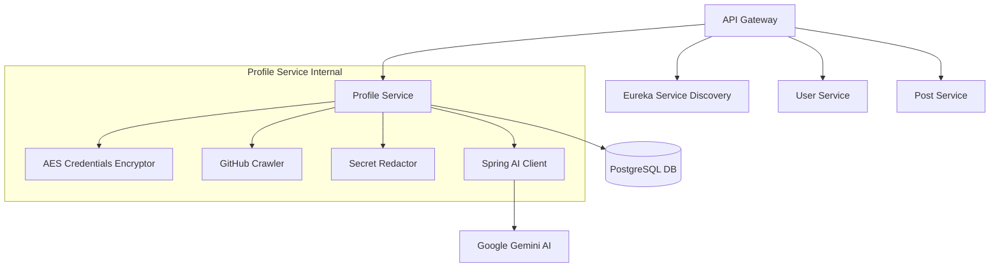

# Aditya Debnath

🚀 **AI & Backend Engineer | Distributed Systems & AI Agents**

I am a backend-focused software engineer specializing in building secure, high-concurrency distributed systems and AI-powered products. I design and scale applications utilizing LLMs, Retrieval-Augmented Generation (RAG), and multi-agent workflows.

---

### 🛠️ Core Tech Stack

| Category | Technologies |
| :--- | :--- |
| **Languages** |    |
| **Backend & Microservices** |     |
| **AI, RAG & Agents** |     |
| **Databases & Vector Search** |     |
| **Infrastructure & Tools** |      |

---

### ⭐️ Highlighted Project: Nexora

**Nexora** is a proof-of-work developer network that replaces self-reported resume buzzwords with verified, inspectable code citations.

*   **Architecture:** Multi-service system powered by **Spring Boot**, **Spring Cloud (Eureka, API Gateway)**, and **PostgreSQL**.
*   **Security & Redaction:** Built a local extraction layer that scrubs secrets, JWT tokens, and credentials before transmission.
*   **AI Integration:** Leveraged **Spring AI** and **Google Gemini** to audit repository commit logs, pull requests, and file trees to build project-first developer profiles.
*   **System Design:**

---

### 🧠 Core Expertise & Focus Areas

*   **AI Products & RAG:** Architecting Retrieval-Augmented Generation (RAG) pipelines and multi-agent workflows using **LangChain** and **LangGraph** with vector backends like **pgvector** and **Qdrant**.
*   **High-Concurrency & Multithreading:** Deep understanding of multithreading concepts, including the Producer-Consumer problem, custom thread pools, and multithreaded sorting implementations.
*   **Secure API Design:** Extensive implementation of authentication pipelines using **Spring Security**, OAuth2, and JWT.

---

### 📊 GitHub Statistics

  <!-- General Stats Card -->
  
  <!-- Streak Stats Card -->
  
  <!-- Top Languages Card -->
  

---

### 🏋️‍♂️ Fun Fact
*   *My best engineering ideas and system architectures are always explored and solved while I'm exercising.*

---

### 📬 Get in Touch

*   **LinkedIn:** [aditya-debnath-93330b325](https://linkedin.com/in/aditya-debnath-93330b325)
*   **Email:** [debnathaditya2005@gmail.com](mailto:debnathaditya2005@gmail.com)

*⚡ "Evidence before assertion."*
